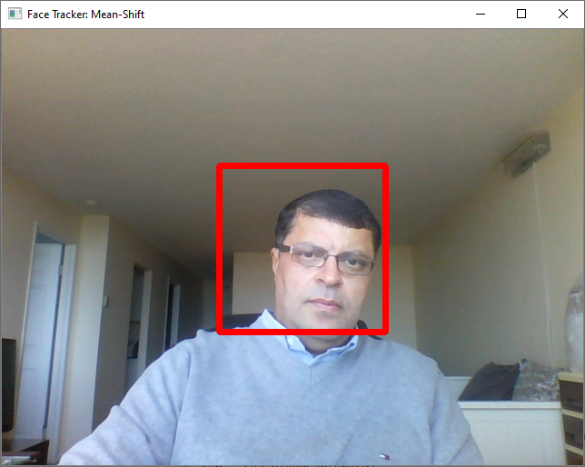

# Face Detection & Tracking from Live Video Stream using OpenCV-Python

## 1. Objective 

The objective of this project is to demonstrate face detection and tracking from live stream video using built-in OpenCV Python Haar Cascade face detector and object tracking functionalities. 

## 2. Face Tracking Approach

* Our implemented approach is as follows: 

  * Once the camera starts capturing the video stream of the person's face in the field of view, we: 
    * Grab the first frame of the video stream and apply Haar Cascades face detector, in order to detect the person's face. 
    * The detected face, as localized by its bounding-box, represented our region of interest (ROI), which is then tracked in the subsequent frames, using the following moving object tracking algorithms:
      * Mean-Shift 
      * Cam-Shift 
      * BOOSTING 
      * MIL 
      * KCF 
      * TLD 
      * MEDIAN FLOW

 Next, we shall illustrate the implementation of this approach and illustrate the face tracking results for each object tracking approach. 

## 3. Development 

* Project: Face Tracking: 
* The objective of this project is to demonstrate face tracking from live stream video using seven built-in OpenCV Python tracking functionalities, as listed above. 
  * We shall assume the following: 
  * The moving camera is fixed or moving 
  * The face is moving 
  * We apply Haar Cascades to detect the face from the first frame of the live stream 
  * Our objective is to track the object of interest in the remaining frames. 

* Author: Mohsen Ghazel (mghazel) 
* Date: April 15th, 2021 

### 3.1. Step 1: Imports and global variables:

#### 3.1.1. Python imports:

<pre style="color:#000020;background:#e6ffff;font-size:10px;line-height:1.5;">#------------------------------------------------------
# Python imports and environment setup
#------------------------------------------------------
# opencv
import cv2
# numpy
import numpy as np
# matplotlib
import matplotlib.pyplot as plt
import matplotlib.image as mpimg

# input/output OS
import os 

# date-time to show date and time
import datetime

# Use %matplotlib notebook to get zoom-able &amp; resize-able notebook. 
# - This is the best for quick tests where you need to work interactively.
# %matplotlib inline

#------------------------------------------------------
# Test imports and display package versions
#------------------------------------------------------
# Testing the OpenCV version
print("OpenCV : ",cv2.__version__)
# Testing the numpy version
print("Numpy : ",np.__version__)

OpenCV :  3.4.8
Numpy :  1.19.2
</pre>

### 3.1.2. Global variables:

Setup and instantiate the Haar Cascades face detector:

<pre style="color:#000020;background:#e6ffff;font-size:10px;line-height:1.5;">#----------------------------------------------------
# Setup the folder comtaining the pre-trained Haar 
# Cascades detector configuration XML files:
#----------------------------------------------------
haar_cascades_configs_folder = "C:/MyWebSites/MyWebsSite/MyProjects/Human-Face/resources/DATA/haarcascades/"

#----------------------------------------------------
# Instantiate the pre-trained Haar Cascades 
# face detector using its configuration file
#----------------------------------------------------
# Instantiate the pre-trained Haar Cascades face detector using its configuration file
face_cascade = cv2.CascadeClassifier(haar_cascades_configs_folder + 'haarcascade_frontalface_default.xml')
</pre>

### 3.2. Step 2: Apply the Mean-Shift Tracker:

* In this section, we shall implement the Mean-Shift Tracker in OpenCV Python:
  * To track a single face from a live video stream

<pre style="color:#000020;background:#e6ffff;font-size:10px;line-height:1.5;">#------------------------------------------------------------
# 2.1) open the video camera and capture a video stream
#------------------------------------------------------------
cap = cv2.VideoCapture(0)
# check the status of the opened video file
if not cap.isOpened():
    print("Cannot capture video stream!")
    exit();
    
# take first frame of the video
ret,frame = cap.read()

#------------------------------------------------------------
# Step 2.2) Detect the face from the first frame
#------------------------------------------------------------
# decet the face from the frame
face_rects = face_cascade.detectMultiScale(frame) 

#------------------------------------------------------------
# Step 2.3) Setup the initial Tracking Window:
#------------------------------------------------------------
# get the bounding-box of the detected face
(face_x,face_y,w,h) = tuple(face_rects[0]) 
# setup the tracking window
track_window = (face_x,face_y,w,h)
# set up the ROI tracking-window for tracking
roi = frame[face_y:face_y+h, face_x:face_x+w]

#------------------------------------------------------------
# Setup 2.4: Start the Mean-Shift tracking of the setup 
#           initial window:
#------------------------------------------------------------
# Use the HSV Color Mapping
hsv_roi =  cv2.cvtColor(roi, cv2.COLOR_BGR2HSV)

# Find histogram to backproject the target on each frame for calculation of meanshit
roi_hist = cv2.calcHist([hsv_roi],[0],None,[180],[0,180])

# Normalize the histogram array values given a min of 0 and max of 255
cv2.normalize(roi_hist,roi_hist,0,255,cv2.NORM_MINMAX)

# Setup the termination criteria, either 10 iteration or move by at least 1 pt
term_crit = ( cv2.TERM_CRITERIA_EPS | cv2.TERM_CRITERIA_COUNT, 10, 1 )

# frame counter
frame_counter = 1;

# iterate over the farmes
while True:
    ret ,frame = cap.read()
    if ret == True:
        
        # Grab the Frame in HSV
        hsv = cv2.cvtColor(frame, cv2.COLOR_BGR2HSV)
        
        # Calculate the Back Projection based off the roi_hist created earlier
        dst = cv2.calcBackProject([hsv],[0],roi_hist,[0,180],1)
        
        # Apply meanshift to get the new coordinates of the rectangle
        ret, track_window = cv2.meanShift(dst, track_window, term_crit)
        
        #----------------------------------
        # Display the tracking results:
        #----------------------------------
        # Draw the new rectangle on the image
        x,y,w,h = track_window
        img2 = cv2.rectangle(frame, (x,y), (x+w,y+h), (0,0,255),5)
        # display the image
        cv2.imshow('Face Tracker: Mean-Shift',img2)
    
        # increment the frame counter
        frame_counter = frame_counter + 1
        
        # quit if user hits: ESC
        k = cv2.waitKey(1) &amp; 0xff
        if k == 27:
            break
        
    else:
        break

# close all windows
cv2.destroyAllWindows()
# realease the camera resources
cap.release()
</pre>

* Sample facing tracking results using the Mean-Shift tracker are illustrated next.

<table>
  <tr>
    <td> </td>
    <td> </td>
   </tr> 
   <tr>
    <td> </td>
    <td> </td>
  </td>
  </tr>
</table>

### 3.3. Step 3: Cam-Shift Tracker:

* In this section, we shall implement the Cam-Shift Tracker in OpenCV Python:
  * To track a single face from a live video stream
  
  
<pre style="color:#000020;background:#e6ffff;font-size:10px;line-height:1.5;">#------------------------------------------------------------
# 3.1) open the video camera and capture a video stream
#------------------------------------------------------------
cap = cv2.VideoCapture(0)
# check the status of the opened video file
if not cap.isOpened():
    print("Cannot capture video stream!")
    exit();
    
# take first frame of the video
ret,frame = cap.read()

#------------------------------------------------------------
# Step 3.2) Detect the face from the first frame
#------------------------------------------------------------
# decet the face from the frame
face_rects = face_cascade.detectMultiScale(frame) 

#------------------------------------------------------------
# Step 3.3) Setup the initial Tracking Window:
#------------------------------------------------------------
# get the bounding-box of the detected face
(face_x,face_y,w,h) = tuple(face_rects[0]) 
# setup the tracking window
track_window = (face_x,face_y,w,h)
# set up the ROI tracking-window for tracking
roi = frame[face_y:face_y+h, face_x:face_x+w]

# Use the HSV Color Mapping
hsv_roi =  cv2.cvtColor(roi, cv2.COLOR_BGR2HSV)

# Find histogram to backproject the target on each frame for calculation of meanshit
roi_hist = cv2.calcHist([hsv_roi],[0],None,[180],[0,180])

# Normalize the histogram array values given a min of 0 and max of 255
cv2.normalize(roi_hist,roi_hist,0,255,cv2.NORM_MINMAX)

# Setup the termination criteria, either 10 iteration or move by at least 1 pt
term_crit = ( cv2.TERM_CRITERIA_EPS | cv2.TERM_CRITERIA_COUNT, 10, 1 )

# frame counter
frame_counter = 1;

# iterate over the farmes
while True:
    ret ,frame = cap.read()
    if ret == True:
        
        # Grab the Frame in HSV
        hsv = cv2.cvtColor(frame, cv2.COLOR_BGR2HSV)
        
        # Calculate the Back Projection based off the roi_hist created earlier
        dst = cv2.calcBackProject([hsv],[0],roi_hist,[0,180],1)
        
        # Apply Camshift to get the new coordinates of the rectangle
        ret, track_window = cv2.CamShift(dst, track_window, term_crit)
       
        #----------------------------------
        # Display the tracking results:
        #----------------------------------
        # Draw the new rectangle on the image
        pts = cv2.boxPoints(ret)
        pts = np.int0(pts)
        img2 = cv2.polylines(frame,[pts],True, (0,0,255),5)
        # display the image
        cv2.imshow('Face Tracker: Cam-Shift',img2)
        
        # increment the frame counter
        frame_counter = frame_counter + 1
        
        # quit if user hits: ESC
        k = cv2.waitKey(1) &amp; 0xff
        if k == 27:
            break
        
    else:
        break
        
# close all windows
cv2.destroyAllWindows()
# realease the camera resources
cap.release()
</pre>

* Sample facing tracking results using the Cam-Shift tracker are illustrated next.

<table>
  <tr>
    <td> </td>
    <td> </td>
   </tr> 
   <tr>
    <td> </td>
    <td> </td>
  </td>
  </tr>
</table>

### 3.4. Step 4: OpenCV Object Tracking API:

* In this section, we shall implement the Tracking APIs (Built-in with OpenCV):
  * We get the following options to experiment with the following trackers:
    * Enter 0 for BOOSTING
    * Enter 1 for MIL
    * Enter 2 for KCF
    * Enter 3 for TLD
    * Enter 4 for MEDIANFLOW
    

<pre style="color:#000020;background:#e6ffff;font-size:10px;line-height:1.5;">'''
Gets the user tracker selection:
'''
def ask_for_tracker():
print("Please select the Tracker API would you like to use:")
    print("Enter 0 for BOOSTING: ")
    print("Enter 1 for MIL: ")
    print("Enter 2 for KCF: ")
    print("Enter 3 for TLD: ")
    print("Enter 4 for MEDIANFLOW: ")
    choice = input("Please select your tracker: ")
    
    if choice == '0':
        tracker = cv2.TrackerBoosting_create()
    if choice == '1':
        tracker = cv2.TrackerMIL_create()
    if choice == '2':
        tracker = cv2.TrackerKCF_create()
    if choice == '3':
        tracker = cv2.TrackerTLD_create()
    if choice == '4':
        tracker = cv2.TrackerMedianFlow_create()

    return tracker
</pre>

<pre style="color:#000020;background:#e6ffff;font-size:10px;line-height:1.5;"># Get the tracker user option
tracker = ask_for_tracker()
# Get the tracker user option name
print("User selected Tracker: " + str(tracker).split()[0][1:])

Please select the Tracker API would you like to use:
Enter 0 for BOOSTING: 
Enter 1 for MIL: 
Enter 2 for KCF: 
Enter 3 for TLD: 
Enter 4 for MEDIANFLOW: 
Please select your tracker: 1
User selected Tracker: TrackerMIL
</pre>

<pre style="color:#000020;background:#e6ffff;font-size:10px;line-height:1.5;">#------------------------------------------------------------
# Get the user Tracker-option:
#------------------------------------------------------------
# Get the tracker option from the user
tracker = ask_for_tracker()
# get the tracker name
tracker_name = str(tracker).split()[0][1:]

#------------------------------------------------------------
# open the video camera and capture a video stream
#------------------------------------------------------------
cap = cv2.VideoCapture(0)
# check the status of the opened video file
if not cap.isOpened():
    print("Cannot capture video stream!")
    exit();
    
# take first frame of the video
ret,frame = cap.read()

# Special function allows us to draw on the very first frame our desired ROI
roi = cv2.selectROI(frame, False)

# Initialize tracker with first frame and bounding box
ret = tracker.init(frame, roi)

# frame counter
frame_counter = 1;

# iterate over the farmes
while True:
    # Read a new frame
    ret, frame = cap.read()

    # Update tracker
    success, roi = tracker.update(frame)
    
    # roi variable is a tuple of 4 floats
    # We need each value and we need them as integers
    (x,y,w,h) = tuple(map(int,roi))
    
    # Draw Rectangle as Tracker moves
    if success:
        # Tracking success
        p1 = (x, y)
        p2 = (x+w, y+h)
        cv2.rectangle(frame, p1, p2, (0,255,0), 3)
    else :
        # Tracking failure
        cv2.putText(frame, "Failure to Detect Tracking!!", (100,200), cv2.FONT_HERSHEY_SIMPLEX, 1,(0,0,255),3)

    # Display tracker type on frame
    cv2.putText(frame, tracker_name, (20,400), cv2.FONT_HERSHEY_SIMPLEX, 1, (0,255,0),3);

    #------------------------------------------------------------
    # Display the tracking results:
    #------------------------------------------------------------
    # Draw the new rectangle on the image
    cv2.imshow('Face Tracker: ' + tracker_name, frame)
       
    # increment the frame counter
    frame_counter = frame_counter + 1
        
    # Exit if ESC pressed
    k = cv2.waitKey(1) &amp; 0xff
    if k == 27 : 
        break
#------------------------------------------------------------        
# close all windows
#------------------------------------------------------------
cv2.destroyAllWindows()
# realease the camera resources
cap.release()

Please select the Tracker API would you like to use:
Enter 0 for BOOSTING: 
Enter 1 for MIL: 
Enter 2 for KCF: 
Enter 3 for TLD: 
Enter 4 for MEDIANFLOW: 
Please select your tracker: 1
</pre>

* Sample facing tracking results using the BOOSTING Tracker are illustrated next.. Similar tracking results can be obtained by selecting and executing the other four trackers. 

<table>
  <tr>
    <td> </td>
    <td> </td>
   </tr> 
   <tr>
    <td> </td>
    <td> </td>
  </td>
  <tr>
    <td> </td>
    <td> </td>
  </td>
  </tr>
</table>

### 3.5. Step 5: Display a successful execution message:

<pre style="color:#000020;background:#e6ffff;font-size:10px;line-height:1.5;"># display a final message
# current time
now = datetime.datetime.now()
# display a message
print('Program executed successfully on: '+ str(now.strftime("%Y-%m-%d %H:%M:%S") + "...Goodbye!\n"))

Program executed successfully on: 2021-04-15 18:08:21...Goodbye!
</pre>

## 4. Analysis

* We have demonstrated single face detection and tracking from live video stream using 7 tracking algorithms implemented in OpenCV Python:

  * The 5 tracking algorithms implemented in the OpenCV Tracking API all performed equally and extremely well, yielding nearly perfect tracking of the moving object of interest.
  * BOOSTING
  * MIL
  * KCF
  * TLD
  * MEDIAN FLOW
  * The other 2 tracking algorithms generally yield inadequate face tracking results, especially when the face is turned sideway form the camera:
    * Mean-Shift
    * Cam-Shift

## 5. Future Work

* We propose to explore the following related issues:

  * To explore these implemented tracking algorithm and get a better understating of:
    * How each algorithm works
    * The advantages and limitations of each algorithm
    * To implement multi-object trackers for tracking and distinguishing multiple objects at the same time.

## 6. References

1. Adrian Rosebrock. OpenCV Object Tracking. https://www.pyimagesearch.com/2018/07/30/opencv-object-tracking/ 
2. Adrian Rosebrock. Simple object tracking with OpenCV. https://www.pyimagesearch.com/2018/07/23/simple-object-tracking-with-opencv/ 
3. Satya Mallick. Object Tracking using OpenCV. https://learnopencv.com/object-tracking-using-opencv-cpp-python/ 
4. Anna Petrovicheva. Multiple Object Tracking in Realtime. https://opencv.org/multiple-object-tracking-in-realtime/ 
5. Ehsan Gazar. Object Tracking with OpenCV. https://ehsangazar.com/object-tracking-with-opencv-fd18ccdd7369 
6. Automatic Addison. Real-Time Object Tracking Using OpenCV and a Webcam. https://automaticaddison.com/real-time-object-tracking-using-opencv-and-a-webcam/ 
7. Automatic Addison. How to Do Multiple Object Tracking Using OpenCV. https://automaticaddison.com/how-to-do-multiple-object-tracking-using-opencv/

  
  
